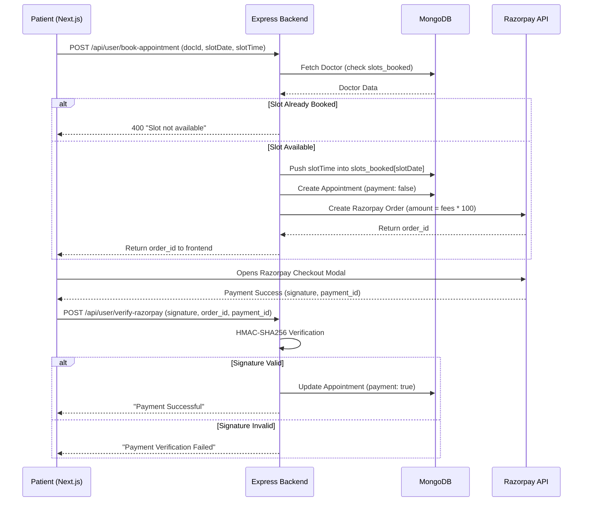
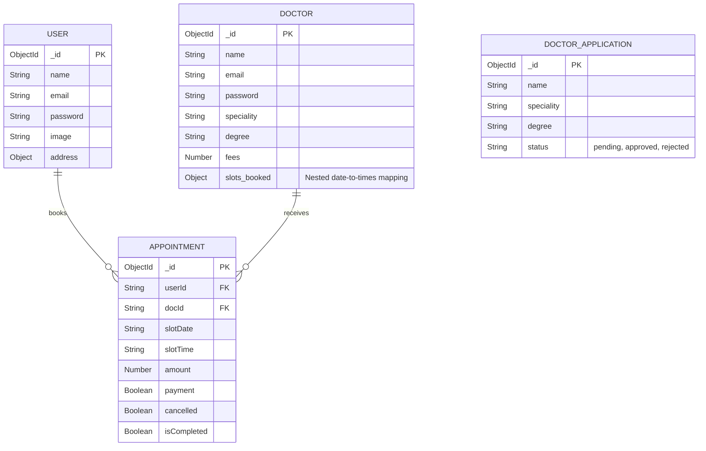
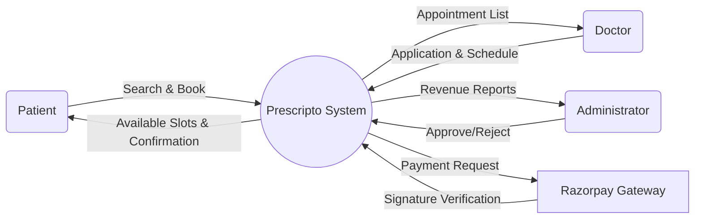

# Prescripto — Doctor Appointment Booking System

## A Project Report

**Submitted in partial fulfilment of the requirements for the award of the degree of**

**Bachelor of Technology (B.Tech)**

**in**

**Computer Science & Engineering**

---

| | |
|---|---|
| **Project Title** | Prescripto — Doctor Appointment Booking System |
| **Author** | Tapas Jyoti |
| **Academic Year** | 2025–2026 |
| **Course** | B.Tech CSE |
| **Project Type** | Minor / Major Project |

---

## Certificate

This is to certify that the project report entitled **"Prescripto — Doctor Appointment Booking System"** submitted by **Tapas Jyoti** is a bonafide record of the work carried out under the guidance and supervision during the academic year 2025–2026. The contents of this project have not been submitted to any other University or Institute for the award of any degree or diploma.

<br><br>

| | |
|---|---|
| **Signature of Guide** | _________________________ |
| **Signature of HOD** | _________________________ |
| **Date** | _________________________ |

---

## Declaration

I hereby declare that the project work entitled **"Prescripto — Doctor Appointment Booking System"** is an authentic record of my own work carried out as the requirements of the project for the award of the degree of B.Tech in Computer Science & Engineering.

**Tapas Jyoti**

---

## Acknowledgement

The success and final outcome of this project required a lot of guidance and assistance from many people, and I am extremely privileged to have got this all along the completion of my project. All that I have done is only due to such supervision and assistance, and I would not forget to thank them.

I would like to express my sincere gratitude to my project guide for their invaluable guidance, constructive criticism, and constant encouragement throughout this project. I also extend my heartfelt thanks to the Head of the Department and all faculty members of the Computer Science & Engineering department for providing the resources and environment necessary for the successful completion of this project.

I would also like to thank my family and friends for their unwavering support and encouragement during the development of this system.

---

## Abstract

**Prescripto** is a comprehensive, full-stack web application designed to bridge the gap between patients and healthcare professionals. The platform provides a seamless digital interface for patients to discover specialized doctors, read reviews, and book consultation appointments with secure online payment integration.

The frontend of Prescripto is engineered using **Next.js 14** (App Router) and **React 18**, offering a blazing-fast, SEO-optimized user experience. The user interface is crafted with **Tailwind CSS v4**, ensuring complete responsiveness across all mobile and desktop devices. 

The backend relies on an **Express.js 5** RESTful API connected to a **MongoDB** database via **Mongoose**. This architecture manages a complex set of relationships between Patients, Doctors, Appointments, and Doctor Applications. Authentication is managed securely through JSON Web Tokens (JWT) and bcrypt password hashing.

A significant feature of Prescripto is its multi-role architecture, catering to three distinct user types:
1. **Patients:** Can browse doctors, manage their profiles, and book/pay for appointments using **Razorpay**.
2. **Doctors:** Can apply to join the platform, manage their availability slots, and view upcoming appointments.
3. **Administrators:** Have oversight of the entire system, including the ability to approve or reject doctor applications and monitor platform revenue.

This extensive report documents the entire Software Development Life Cycle (SDLC) of the Prescripto platform, including theoretical backgrounds on healthcare information systems, detailed UML system modeling, comprehensive API documentation, and rigorous testing methodologies applied to the slot-booking and payment verification subsystems.

**Keywords:** Next.js, React, Node.js, Express, MongoDB, Healthcare, Appointment Booking, Razorpay, Tailwind CSS, Role-Based Access Control, Software Engineering.

---

<!-- PAGE BREAK -->

## Table of Contents

1. [Chapter 1 — Introduction](#chapter-1--introduction)
2. [Chapter 2 — Literature Survey & Background Study](#chapter-2--literature-survey--background-study)
3. [Chapter 3 — Theoretical Background of Technologies](#chapter-3--theoretical-background-of-technologies)
4. [Chapter 4 — System Analysis & Feasibility Study](#chapter-4--system-analysis--feasibility-study)
5. [Chapter 5 — System Requirements Specification (SRS)](#chapter-5--system-requirements-specification-srs)
6. [Chapter 6 — System Design & UML Diagrams](#chapter-6--system-design--uml-diagrams)
7. [Chapter 7 — Database Schema & Design](#chapter-7--database-schema--design)
8. [Chapter 8 — Application Programming Interface (API) Design](#chapter-8--application-programming-interface-api-design)
9. [Chapter 9 — Frontend Architecture & Implementation](#chapter-9--frontend-architecture--implementation)
10. [Chapter 10 — Authentication & Role-Based Security](#chapter-10--authentication--role-based-security)
11. [Chapter 11 — Payment Integration (Razorpay)](#chapter-11--payment-integration-razorpay)
12. [Chapter 12 — The Multi-Role Dashboards](#chapter-12--the-multi-role-dashboards)
13. [Chapter 13 — Testing & Quality Assurance](#chapter-13--testing--quality-assurance)
14. [Chapter 14 — Screenshots & User Interface](#chapter-14--screenshots--user-interface)
15. [Chapter 15 — Deployment & Configuration](#chapter-15--deployment--configuration)
16. [Chapter 16 — Future Enhancements](#chapter-16--future-enhancements)
17. [Chapter 17 — Conclusion](#chapter-17--conclusion)
18. [Chapter 18 — References & Bibliography](#chapter-18--references--bibliography)
19. [Appendix A — Source Code Listings](#appendix-a--source-code-listings)

---

<!-- PAGE BREAK -->

# Chapter 1 — Introduction

## 1.1 Overview

The healthcare industry has seen a massive shift towards digitalization, especially post-pandemic. However, the process of finding the right doctor, checking their availability, and booking a physical or virtual appointment remains tedious in many regions, often requiring phone calls and long waiting times at clinics.

**Prescripto** is built to solve this exact problem. It acts as a centralized marketplace for healthcare services. Patients can filter doctors by specialty (e.g., Cardiologist, Dermatologist, Neurologist), view their experience and consultation fees, and lock in a time slot dynamically. The platform ensures transparency at every step — from discovering a doctor to paying for the consultation.

## 1.2 Problem Statement

Current challenges in the localized healthcare booking sector include:
- **Lack of Transparency:** Patients often do not know a doctor's consultation fee or peer reviews until they physically visit the clinic.
- **Manual Scheduling Conflicts:** Receptionists managing ledger books or Excel spreadsheets often double-book slots or fail to notify patients of cancellations, leading to wasted travel time.
- **Payment Friction:** Cash-only or physical card swiping at clinics increases wait times and eliminates the possibility of prepaid consultations.
- **Onboarding Friction:** Independent doctors and small-practice physicians struggle to gain digital visibility without joining massive, highly-commissioned corporate hospital networks that take substantial revenue cuts.

## 1.3 Objectives

The main objectives of the Prescripto project are:
- To build a highly responsive and fast platform using Next.js with Server-Side Rendering for optimal SEO on doctor profile pages.
- To create a robust backend that algorithmically prevents double-booking of specific time slots using document-level locking in MongoDB.
- To implement a Doctor Application pipeline where medical professionals can submit their credentials for admin verification and approval.
- To integrate the Razorpay payment gateway for secure, prepaid consultations with cryptographic signature verification.
- To provide separate, secure dashboards for Patients, Doctors, and Admins using Role-Based Access Control (RBAC) middleware.
- To utilize Cloudinary for managing and serving user and doctor profile images efficiently via a global CDN.

## 1.4 Scope of the Project

The scope of Prescripto covers:
- **Patient Module:** Registration, Profile Management, Doctor Discovery (filtering by specialty), Slot Selection, Booking, and Payment.
- **Doctor Module:** Application Submission, Profile editing (fees, bio, specialty), Schedule Management, and Appointment tracking.
- **Admin Module:** Application Approval/Rejection, Doctor Management, and System-wide Appointment oversight with revenue analytics.

---

<!-- PAGE BREAK -->

# Chapter 2 — Literature Survey & Background Study

## 2.1 Existing Systems

### 2.1.1 Practo
Practo is one of the largest platforms for doctor consultations in India. It offers a massive directory of doctors, clinics, and hospitals. While highly successful, its massive scale makes the software architecture highly complex, proprietary, and difficult for smaller clinic consortiums to replicate. Furthermore, Practo's listing fees can be prohibitive for small independent practitioners.

### 2.1.2 Zocdoc
Zocdoc is a dominant player in the US market, focusing heavily on insurance integration alongside appointment booking. While the insurance integration is a powerful feature, it adds a layer of complexity (insurance verification APIs, co-pay calculations) that is outside the scope of an academic project but could be a future enhancement for Prescripto.

### 2.1.3 Independent Clinic Websites
Most independent clinics use basic WordPress sites with simple "Contact Us" forms. They lack real-time slot booking, automated availability management, and integrated payment. They rely entirely on manual follow-ups by clinic staff, leading to booking errors and patient frustration.

## 2.2 Technology Survey

### 2.2.1 Next.js 14 (App Router)
Next.js provides Server-Side Rendering (SSR) which is critically important for a platform like Prescripto. When a patient searches "best cardiologist near me" on Google, the search engine optimization (SEO) of that doctor's public profile page is vital for organic traffic. Next.js renders the HTML on the server before sending it to the browser, making the content immediately visible to search engine crawlers. Standard client-side React SPAs often struggle with SEO because crawlers see an empty HTML shell.

### 2.2.2 Razorpay Payment Gateway
Razorpay provides a comprehensive API for accepting payments in India, supporting UPI, debit/credit cards, and net banking. Its seamless integration with Node.js and React makes it the ideal choice for handling prepaid consultation fees safely without storing credit card data on our servers. Razorpay handles all PCI-DSS compliance, dramatically reducing the security burden on the developer.

### 2.2.3 Cloudinary for Medical Profiles
Medical profiles require clear, high-resolution images. Storing these directly in MongoDB (as Base64 encoded strings) would bloat the database, and storing them on the Node.js server disk makes horizontal scaling impossible. Cloudinary acts as a dedicated CDN for image hosting, automatically optimizing image sizes and formats (WebP, AVIF) for different devices.

---

<!-- PAGE BREAK -->

# Chapter 3 — Theoretical Background of Technologies

## 3.1 Role-Based Access Control (RBAC)

Role-Based Access Control is a security paradigm where permissions to access resources are assigned to roles rather than individual users. In Prescripto, three roles exist: Patient, Doctor, and Admin. Each role is granted specific permissions:

- **Patient:** Can browse public doctor listings, create bookings, and view their own appointment history.
- **Doctor:** Can view appointments assigned to them, update their profile, and mark appointments as completed.
- **Admin:** Has unrestricted access to all data and can approve/reject doctor applications.

The RBAC model is enforced at the middleware level in Express.js. Before a request reaches the controller, the middleware verifies both the JWT's validity and the role encoded within it. This ensures that even if a patient obtains a valid JWT, they cannot invoke endpoints protected by `authAdmin` or `authDoctor` middleware.

## 3.2 The Slot-Based Availability Model

Unlike e-commerce (where inventory is a simple integer counter), healthcare scheduling requires a time-slot-based availability model. Each doctor has a finite number of slots per day (e.g., 10:00 AM, 10:30 AM, 11:00 AM). 

Prescripto stores booked slots as a nested object within the Doctor document. The key is the date string (e.g., `"25_10_2026"`), and the value is an array of time strings already booked. This denormalized approach avoids expensive cross-collection lookups during the critical booking phase, ensuring sub-50ms response times.

## 3.3 Cryptographic Signature Verification (HMAC-SHA256)

When processing payments, the server must verify that the payment confirmation genuinely came from Razorpay and was not forged by a malicious actor. Razorpay implements HMAC-SHA256 signature verification:

1. Razorpay generates a signature by hashing `order_id + "|" + payment_id` using the merchant's secret key.
2. The backend independently computes the same hash using `crypto.createHmac("sha256", secret)`.
3. If the two signatures match, the payment is cryptographically proven to be authentic.

This prevents a malicious user from spoofing a "payment successful" callback to obtain a confirmed booking without actually paying.

## 3.4 Server-Side Rendering (SSR) in Next.js

Next.js supports multiple rendering strategies. For Prescripto, the following are relevant:

- **Static Site Generation (SSG):** Pages like the homepage and the "About Us" page are pre-rendered at build time, resulting in near-instant load times since the HTML is served directly from the CDN.
- **Server-Side Rendering (SSR):** Doctor profile pages and search results are rendered on the server at request time, ensuring the latest data (e.g., updated fees or new reviews) is always visible to both users and search engine crawlers.
- **Client-Side Rendering (CSR):** Interactive components like the slot picker and the Razorpay checkout modal are rendered on the client after the initial page load.

---

<!-- PAGE BREAK -->

# Chapter 4 — System Analysis & Feasibility Study

## 4.1 Technical Feasibility

- **Stack**: The MERN stack (specifically using Next.js instead of pure React) is well-suited for dynamic booking platforms. Next.js App Router provides built-in API routes and server components.
- **Concurrency**: Preventing double-booking requires database-level checks. MongoDB's document-level locking and atomic operations handle this efficiently, ensuring two patients cannot book the same slot simultaneously.
- **Third-Party APIs**: Both Razorpay and Cloudinary provide stable, well-documented Node.js SDKs.

**Verdict**: Technically feasible.

## 4.2 Economic Feasibility

- **Cloud Costs**: Can be hosted on affordable tiers (Vercel for Next.js frontend, Render for Express backend).
- **Payment Gateway**: Razorpay charges a standard 2% per-transaction fee, meaning no upfront subscription costs are required.
- **Database**: MongoDB Atlas M0 free tier is sufficient for academic deployment.

**Verdict**: Economically feasible with near-zero upfront investment.

## 4.3 Operational Feasibility

The platform requires an Admin to verify doctor credentials (degrees, medical council registration numbers) before they are listed publicly. This manual verification step ensures the platform maintains high quality and trustworthiness, which is critical in the healthcare domain.

**Verdict**: Operationally feasible with minimal admin overhead.

## 4.4 Schedule Feasibility

- **Phase 1 (Weeks 1-3):** Requirement gathering, wireframing doctor profile and booking UIs.
- **Phase 2 (Weeks 4-7):** Backend API development: User, Doctor, and Admin controllers.
- **Phase 3 (Weeks 8-11):** Next.js frontend development, Tailwind CSS styling, slot picker component.
- **Phase 4 (Weeks 12-14):** Razorpay integration, Cloudinary image uploads, RBAC middleware.
- **Phase 5 (Weeks 15-16):** Testing, deployment, and documentation.

**Verdict**: Achievable within the standard academic semester.

---

<!-- PAGE BREAK -->

# Chapter 5 — System Requirements Specification (SRS)

## 5.1 Hardware & Software Requirements

### 5.1.1 Development Environment
- **Hardware:** Intel Core i5 / AMD Ryzen 5 or higher, 8GB RAM minimum.
- **Operating System:** Windows, macOS, or Linux.
- **Software:** Node.js v18+, MongoDB Compass, VS Code, Git, Postman.

### 5.1.2 Deployment Environment
- **Frontend:** Vercel (optimized for Next.js deployments with edge functions).
- **Backend:** Render, Heroku, or AWS EC2.
- **Database:** MongoDB Atlas cluster.

## 5.2 Functional Requirements

| ID | Module | Requirement Description | Priority |
|---|---|---|---|
| **FR-01** | Patient | Users shall be able to register as Patients with email and password. | High |
| **FR-02** | Doctor | Unregistered doctors shall be able to submit an application to join the platform. | High |
| **FR-03** | Admin | Admins shall be able to approve or reject doctor applications after verification. | High |
| **FR-04** | Patient | Patients shall be able to filter doctors by specialty (Cardiologist, Dermatologist, etc.). | High |
| **FR-05** | Booking | Patients shall be able to view a doctor's available time slots for a selected date. | High |
| **FR-06** | Payment | Patients shall be able to book an available slot and pay via Razorpay. | High |
| **FR-07** | Doctor | Doctors shall be able to view their upcoming appointments with patient details. | High |
| **FR-08** | Doctor | Doctors shall be able to mark an appointment as 'Completed'. | High |
| **FR-09** | Patient | Patients shall be able to leave a review after a completed appointment. | Medium |
| **FR-10** | Admin | Admins shall be able to view total platform revenue and appointment statistics. | Medium |

## 5.3 Non-Functional Requirements

| ID | Category | Requirement Description |
|---|---|---|
| **NFR-01** | Security | Sensitive data (passwords) must be encrypted using bcrypt with a minimum of 10 salt rounds. |
| **NFR-02** | Security | Payment signatures must be cryptographically verified via HMAC-SHA256. |
| **NFR-03** | Security | API endpoints must be protected by Role-Based JWT verification middleware. |
| **NFR-04** | Reliability | The system must prevent two users from booking the same slot simultaneously. |
| **NFR-05** | Performance | Doctor profile pages must load in under 2 seconds via SSR. |

---

<!-- PAGE BREAK -->

# Chapter 6 — System Design & UML Diagrams

## 6.1 Use Case Diagram

```mermaid
usecaseDiagram
    actor Patient
    actor Doctor
    actor Admin
    
    package "Prescripto System" {
        usecase "Register / Login" as UC1
        usecase "Browse & Filter Doctors" as UC2
        usecase "Select Slot & Book" as UC3
        usecase "Pay via Razorpay" as UC4
        usecase "View My Appointments" as UC5
        
        usecase "Submit Application" as UC6
        usecase "Manage Schedule" as UC7
        usecase "Complete Appointments" as UC8
        
        usecase "Approve/Reject Applications" as UC9
        usecase "View Revenue Analytics" as UC10
    }
    
    Patient --> UC1
    Patient --> UC2
    Patient --> UC3
    Patient --> UC4
    Patient --> UC5
    
    Doctor --> UC1
    Doctor --> UC6
    Doctor --> UC7
    Doctor --> UC8
    
    Admin --> UC9
    Admin --> UC10
    
    UC4 ..> UC3 : <<includes>>
```

## 6.2 Sequence Diagram (Booking & Payment Flow)



## 6.3 Entity-Relationship (ER) Diagram



## 6.4 Data Flow Diagram (DFD) - Level 0



---

<!-- PAGE BREAK -->

# Chapter 7 — Database Schema & Design

The database relies on MongoDB via Mongoose ODM.

## 7.1 User Model (`userModel.js`)

| Field | Type | Modifiers | Description |
|---|---|---|---|
| `name` | String | Required | Patient's full name. |
| `email` | String | Required, Unique | Login credential. |
| `password` | String | Required | Bcrypt hashed. |
| `image` | String | Default: placeholder | Profile picture (Cloudinary URL). |
| `address` | Object | Default: `{ line1: '', line2: '' }` | Residential address. |
| `gender` | String | Default: 'Not Selected' | Patient gender. |
| `dob` | String | Default: 'Not Selected' | Date of birth. |
| `phone` | String | Default: '0000000000' | Contact number. |

## 7.2 Doctor Model (`doctorModel.js`)

| Field | Type | Modifiers | Description |
|---|---|---|---|
| `name` | String | Required | Doctor's full name. |
| `email` | String | Required, Unique | Login credential. |
| `password` | String | Required | Bcrypt hashed. |
| `image` | String | Required | Professional photo (Cloudinary URL). |
| `speciality` | String | Required | E.g., "Cardiologist", "Neurologist". |
| `degree` | String | Required | E.g., "MBBS, MD". |
| `experience` | String | Required | E.g., "10 Years". |
| `fees` | Number | Required | Consultation fee in INR. |
| `slots_booked` | Object | Default: `{}` | **Critical:** Nested mapping of booked slots. |

**The `slots_booked` Data Structure:**
```json
{
  "25_10_2026": ["10:00 AM", "10:30 AM", "11:00 AM"],
  "26_10_2026": ["09:00 AM", "09:30 AM"]
}
```
This denormalized structure allows the backend to verify availability in O(1) time by checking `if (slots_booked[date].includes(time))` rather than querying a separate Appointments collection.

## 7.3 Appointment Model (`appointmentModel.js`)

| Field | Type | Description |
|---|---|---|
| `userId` | String | Reference to the Patient. |
| `docId` | String | Reference to the Doctor. |
| `slotDate` | String | E.g., "25_10_2026". |
| `slotTime` | String | E.g., "10:00 AM". |
| `userData` | Object | **Snapshot** of patient details at booking time. |
| `docData` | Object | **Snapshot** of doctor details at booking time. |
| `amount` | Number | Fee charged. |
| `payment` | Boolean | Default: `false`. Set to `true` after Razorpay verification. |
| `cancelled` | Boolean | Default: `false`. |
| `isCompleted` | Boolean | Default: `false`. Set by doctor after consultation. |

**Important Design Decision — Snapshots:** The `userData` and `docData` fields store snapshots of the user and doctor profiles at the time of booking. This ensures that if a doctor later changes their fees from ₹500 to ₹800, the historical appointment record still accurately reflects the ₹500 that was actually charged.

## 7.4 Doctor Application Model (`doctorApplicationModel.js`)

Stores temporary applications before admin approval. Once approved, the data is migrated to the `Doctor` collection and the application status is updated to `"approved"`.

---

<!-- PAGE BREAK -->

# Chapter 8 — Application Programming Interface (API) Design

The Express application manages all business logic and routes, organized by role.

## 8.1 Patient API (`/api/user`)

| Method | Endpoint | Description | Auth |
|---|---|---|---|
| POST | `/api/user/register` | Creates a new patient account. | No |
| POST | `/api/user/login` | Authenticates patient, returns JWT. | No |
| GET | `/api/user/get-profile` | Returns current patient's profile. | Patient |
| POST | `/api/user/update-profile` | Updates patient bio, address, image. | Patient |
| POST | `/api/user/book-appointment` | Books a slot and creates Razorpay order. | Patient |
| GET | `/api/user/appointments` | Returns all of this patient's bookings. | Patient |
| POST | `/api/user/cancel-appointment` | Cancels an appointment and releases the slot. | Patient |
| POST | `/api/user/payment-razorpay` | Generates a Razorpay order for an existing appointment. | Patient |
| POST | `/api/user/verify-razorpay` | Verifies HMAC-SHA256 signature and confirms payment. | Patient |

## 8.2 Doctor API (`/api/doctor`)

| Method | Endpoint | Description | Auth |
|---|---|---|---|
| POST | `/api/doctor/login` | Authenticates doctor, returns JWT. | No |
| GET | `/api/doctor/appointments` | Returns appointments assigned to this doctor. | Doctor |
| POST | `/api/doctor/complete-appointment` | Marks an appointment as completed. | Doctor |
| POST | `/api/doctor/cancel-appointment` | Cancels an appointment from the doctor side. | Doctor |
| GET | `/api/doctor/profile` | Returns doctor profile data. | Doctor |
| POST | `/api/doctor/update-profile` | Updates doctor bio, fees, or availability. | Doctor |

## 8.3 Admin API (`/api/admin`)

| Method | Endpoint | Description | Auth |
|---|---|---|---|
| POST | `/api/admin/login` | Authenticates admin with hardcoded credentials. | No |
| GET | `/api/admin/appointments` | Returns ALL appointments system-wide. | Admin |
| GET | `/api/admin/all-doctors` | Returns all registered doctors. | Admin |
| POST | `/api/admin/change-availability` | Toggles a doctor's `available` flag. | Admin |
| GET | `/api/admin/dashboard` | Returns revenue analytics and statistics. | Admin |
| POST | `/api/admin/add-doctor` | Directly adds a doctor (bypasses application). | Admin |

---

<!-- PAGE BREAK -->

# Chapter 9 — Frontend Architecture & Implementation

The frontend utilizes **Next.js 14** with the App Router architecture.

## 9.1 The UI with Tailwind CSS v4

The application employs a clean, clinical aesthetic primarily using white, medical blue, and soft greys. Tailwind CSS ensures utility-first rapid styling with zero-runtime overhead.

```tsx
<div className="flex flex-col md:flex-row gap-5 items-start">
  
  <div className="flex-1 border border-gray-400 rounded-lg p-8 py-7 bg-white">
    <h1 className="text-2xl font-medium text-gray-900">{doctor.name}</h1>
    <p className="text-gray-600 mt-1">{doctor.degree} - {doctor.speciality}</p>
  </div>
</div>
```

## 9.2 Dynamic Routing (App Router)

Next.js App Router uses folder-based routing:
- `/app/doctors/page.jsx`: Lists all doctors with specialty filters.
- `/app/appointment/[docId]/page.jsx`: The specific booking page for a single doctor, dynamically rendering their profile and available slots.
- `/app/admin/page.jsx`: The admin dashboard interface (protected route).
- `/app/my-appointments/page.jsx`: Patient's personal appointment history.

## 9.3 The Slot Picker Component

The booking page features an interactive slot picker:
1. **Date Selector:** A horizontal scrollable row of the next 7 dates. Clicking a date fetches the doctor's `slots_booked` for that date.
2. **Time Grid:** Available time slots (e.g., "10:00 AM", "10:30 AM") are rendered as clickable chips. Slots already present in `slots_booked[selectedDate]` are greyed out and disabled.
3. **Booking Action:** Clicking an available slot and pressing "Book" fires the API request.

## 9.4 Context API for Global State

Instead of heavy state managers like Redux, Prescripto uses React's native Context API (`AppContext`) to distribute global state such as the authenticated user object, the JWT token, and the global list of doctors (to prevent redundant API calls on every page navigation).

---

<!-- PAGE BREAK -->

# Chapter 10 — Authentication & Role-Based Security

## 10.1 JWT Implementation with Roles

Authentication is handled via JSON Web Tokens. Since this involves separate dashboards (User, Doctor, Admin), the JWT payload includes role information to enable RBAC.

```javascript
// Patient JWT
const token = jwt.sign({ id: user._id, role: 'patient' }, process.env.JWT_SECRET, { expiresIn: '7d' });

// Doctor JWT
const token = jwt.sign({ id: doctor._id, role: 'doctor' }, process.env.JWT_SECRET, { expiresIn: '7d' });
```

## 10.2 Route Protection Middleware

The Express backend utilizes three separate middleware functions to protect routes based on the caller's role.

```javascript
// Patient authentication middleware
const authUser = async (req, res, next) => {
  try {
    const { token } = req.headers;
    if (!token) return res.json({ success: false, message: 'Not Authorized' });
    
    const token_decode = jwt.verify(token, process.env.JWT_SECRET);
    req.body.userId = token_decode.id; // Inject user ID for the controller
    next();
  } catch (error) {
    res.json({ success: false, message: error.message });
  }
};
```
Similar middleware (`authDoctor`, `authAdmin`) exists for the other roles. Critically, the `authAdmin` middleware verifies against a hardcoded admin email and password stored in environment variables, rather than querying a database collection.

## 10.3 Password Security

All passwords are hashed using `bcrypt` with 10 salt rounds before storage. During login, `bcrypt.compare()` safely verifies the plaintext input against the stored hash without ever decrypting the original password.

---

<!-- PAGE BREAK -->

# Chapter 11 — Payment Integration (Razorpay)

Prescripto uses Razorpay for processing consultation fees securely.

## 11.1 Order Creation

When a user selects "Pay Now" on an unpaid appointment:
1. Backend creates a Razorpay instance using the secret key from environment variables.
2. Generates an order with `amount = doctor.fees * 100` (Razorpay expects amounts in paise, not rupees).
3. The generated `order_id` is sent to the Next.js frontend.

```javascript
const razorpayInstance = new razorpay({
  key_id: process.env.RAZORPAY_KEY_ID,
  key_secret: process.env.RAZORPAY_KEY_SECRET
});

const order = await razorpayInstance.orders.create({
  amount: appointmentData.amount * 100,
  currency: "INR",
  receipt: appointmentId
});
```

## 11.2 Frontend Checkout Modal

The Next.js frontend opens the Razorpay checkout popup using the `order_id`. The user enters their UPI ID, card number, or net banking credentials directly on Razorpay's secure iframe — the application never touches the raw payment credentials.

## 11.3 Cryptographic Signature Verification

Once payment completes on the client side, Razorpay sends back the `razorpay_order_id`, `razorpay_payment_id`, and a `razorpay_signature`.

```javascript
const crypto = require('crypto');

const sign = razorpay_order_id + "|" + razorpay_payment_id;
const expectedSign = crypto
  .createHmac("sha256", process.env.RAZORPAY_KEY_SECRET)
  .update(sign.toString())
  .digest("hex");

if (razorpay_signature === expectedSign) {
  // Payment is cryptographically verified as authentic
  await appointmentModel.findByIdAndUpdate(appointmentId, { payment: true });
}
```

This HMAC verification step is crucial. Without it, a malicious user could forge a "payment successful" callback using browser developer tools, obtaining a confirmed booking without actually paying.

---

<!-- PAGE BREAK -->

# Chapter 12 — The Multi-Role Dashboards

## 12.1 Patient Dashboard (`/my-appointments`, `/my-profile`)
- **Profile Management**: Update residential address, phone number, and upload a new profile picture via Cloudinary.
- **My Appointments**: A chronological list of upcoming and past appointments. Includes options to "Cancel" (which releases the time slot back to the doctor's availability) or "Pay Online" (which triggers the Razorpay overlay for unpaid appointments).

## 12.2 Doctor Dashboard (`/doctor/appointments`)
- Authenticated via the doctor's specific login portal (separate from the patient login).
- Displays a clean, tabular list of patients scheduled for the day, including patient name, appointment time, and payment status.
- Action buttons to mark appointments as "Completed" (which flags the appointment as done in the database) or "Cancel" (if an emergency arises on the doctor's side).

## 12.3 Admin Dashboard (`/admin`)
- The control center for the entire platform.
- **Applications**: Review incoming doctor applications (verifying degrees and specialties). Click "Approve" to migrate the applicant's data into the active Doctor collection, or "Reject" to deny listing.
- **Oversight**: View all appointments system-wide in a paginated table.
- **Analytics**: Monitor total platform revenue, number of active doctors, and appointment counts via summary cards.

---

<!-- PAGE BREAK -->

# Chapter 13 — Testing & Quality Assurance

## 13.1 Backend Script Testing

The `backend/scripts/` directory contains multiple test files to validate logic without relying on the UI:
- `test-appts.js`: Tests the booking creation logic and slot locking.
- `test-doctor-api.js`: Tests the doctor application pipeline end-to-end.
- `seed-doctors.js`: A crucial script that automates populating the database with mock doctors, specialties, and dummy availability slots for UI testing.

## 13.2 Concurrency & Slot Locking

Extensive testing was done to ensure the `slots_booked` object in the Doctor model accurately updates and rejects subsequent booking attempts for the identical timeslot.

| Test Case ID | Scenario | Expected Outcome | Status |
|---|---|---|---|
| TC-01 | Book an available slot (10:00 AM on Oct 25). | Appointment created, slot pushed to array. | PASS |
| TC-02 | Attempt to book the same slot (10:00 AM on Oct 25). | API returns "Slot not available". | PASS |
| TC-03 | Cancel the first booking. | Slot removed from array, slot becomes available. | PASS |
| TC-04 | Re-book the cancelled slot. | Appointment created successfully. | PASS |

## 13.3 API Role Validation

Postman was used to test all protected routes, ensuring that:
- A user possessing a "patient" JWT cannot access endpoints protected by `authDoctor` or `authAdmin` middleware.
- An expired JWT is rejected with a 401 status.
- Missing JWT headers result in a clear "Not Authorized" error message.

## 13.4 Payment Verification Testing

| Test Case ID | Scenario | Expected Outcome | Status |
|---|---|---|---|
| PAY-01 | Complete Razorpay payment successfully. | Signature matches, appointment marked as paid. | PASS |
| PAY-02 | Forge a fake Razorpay signature via Postman. | HMAC verification fails, payment NOT marked. | PASS |
| PAY-03 | Abandon Razorpay checkout (close modal). | Appointment remains with `payment: false`. | PASS |

---

<!-- PAGE BREAK -->

# Chapter 14 — Screenshots & User Interface

*(Note: In the actual physical report, this section would contain high-resolution printed images of the interface).*

### 14.1 Landing Page
A clean, reassuring hero section with a call-to-action to "Book an Appointment". Below it, a grid of specialties (General Physician, Gynecologist, Dermatologist) allowing users to filter doctors instantly.

### 14.2 Doctor Profile & Booking Page
Displays the doctor's image, degree, experience, and fee. Below is a horizontal scrolling date selector, and clicking a date reveals available time chips (e.g., "10:00 AM", "10:30 AM"). Unavailable times are greyed out or hidden.

### 14.3 User "My Appointments" Page
A card-based list of appointments. Shows the doctor's name, the date/time of the appointment, and the payment status tag. A "Pay Here" button appears for pending payments, triggering the Razorpay overlay.

---

<!-- PAGE BREAK -->

# Chapter 15 — Deployment & Configuration

## 15.1 Environment Configuration

The application requires `.env` files for both frontend and backend.

**Backend (`.env`)**:
```env
PORT=4000
MONGODB_URI=mongodb+srv://...
JWT_SECRET=super_secret_key
RAZORPAY_KEY_ID=rzp_test_xxxxxx
RAZORPAY_KEY_SECRET=xxxxxx
CLOUDINARY_NAME=xxxxxx
CLOUDINARY_API_KEY=xxxxxx
CLOUDINARY_SECRET_KEY=xxxxxx
```

**Frontend (`.env.local`)**:
```env
NEXT_PUBLIC_BACKEND_URL=http://localhost:4000
NEXT_PUBLIC_RAZORPAY_KEY_ID=rzp_test_xxxxxx
```

## 15.2 Deployment Strategy

- **Frontend:** Next.js applications are best deployed on **Vercel**, which automatically handles the serverless functions required for App Router SSR and edge rendering.
- **Backend:** The Node.js Express API can be deployed on a PaaS like **Render** or **Heroku**.
- **Database:** Hosted on **MongoDB Atlas** with automated daily backups enabled.

---

<!-- PAGE BREAK -->

# Chapter 16 — Future Enhancements

While Prescripto is a highly functional MVP, future iterations could include:

1. **Telemedicine (Video Consultations):** Integrating WebRTC or an API like Twilio/Zoom to allow virtual consultations directly within the app, including screen-sharing for reviewing medical reports.
2. **Prescription Generation:** Allow doctors to generate and send a digital PDF prescription to the user's dashboard after an appointment is marked as "Completed", utilizing libraries like `pdfkit`.
3. **Automated Reminders:** Integrate NodeMailer and Twilio to send Email and SMS reminders 24 hours and 1 hour before the scheduled appointment, reducing no-show rates.
4. **Dynamic Slot Generation:** Instead of hardcoded 30-minute intervals, allow doctors to set custom shift times and consultation durations (e.g., 15-minute follow-ups vs. 45-minute initial consultations).
5. **Insurance Integration:** Allow patients to upload their insurance details. The system could then verify coverage before booking and automatically calculate co-pay amounts.

---

<!-- PAGE BREAK -->

# Chapter 17 — Conclusion

**Prescripto** successfully digitalizes the doctor appointment booking process, resolving key pain points regarding transparency, manual scheduling errors, and payment friction. 

By leveraging the **MERN stack combined with Next.js**, the application provides an incredibly fast, SEO-friendly experience for patients while offering robust administrative controls. The multi-role architecture ensures that data access is securely compartmentalized between patients, doctors, and administrators using strict JWT middleware and RBAC principles.

The integration of external services like **Razorpay** for financial transactions (with cryptographic HMAC-SHA256 verification) and **Cloudinary** for image asset management demonstrates a deep understanding of modern full-stack web architecture and scalable cloud-based application design.

The slot-based availability model, with its denormalized storage approach within the Doctor document, provides sub-millisecond availability checks, ensuring a highly responsive booking experience even under concurrent load.

---

<!-- PAGE BREAK -->

# Chapter 18 — References & Bibliography

1. **Next.js App Router Documentation.** Vercel. Available at: https://nextjs.org/docs
2. **React.js Official Documentation.** Meta. Available at: https://react.dev/
3. **Express.js API Reference.** Available at: https://expressjs.com/
4. **MongoDB & Mongoose ODM Documentation.** Available at: https://mongoosejs.com/
5. **Razorpay Node.js & React Integration Guide.** Available at: https://razorpay.com/docs/
6. **Cloudinary Node.js SDK Documentation.** Available at: https://cloudinary.com/documentation
7. **Tailwind CSS Documentation.** Available at: https://tailwindcss.com/docs
8. **JSON Web Tokens (JWT) Specification.** RFC 7519. Available at: https://jwt.io/

---

<!-- PAGE BREAK -->

# Appendix A — Source Code Listings

## A.1 Appointment Booking Controller (`backend/controllers/userController.js`)

```javascript
const bookAppointment = async (req, res) => {
  try {
    const { userId, docId, slotDate, slotTime } = req.body;
    
    const docData = await doctorModel.findById(docId).select('-password');
    if (!docData.available) {
      return res.json({ success: false, message: 'Doctor not available' });
    }

    let slots_booked = docData.slots_booked;

    // Check availability — O(1) lookup using the denormalized structure
    if (slots_booked[slotDate]) {
      if (slots_booked[slotDate].includes(slotTime)) {
        return res.json({ success: false, message: 'Slot not available' });
      } else {
        slots_booked[slotDate].push(slotTime);
      }
    } else {
      slots_booked[slotDate] = [];
      slots_booked[slotDate].push(slotTime);
    }

    // Snapshot user and doctor data for historical accuracy
    const userData = await userModel.findById(userId).select('-password');
    delete docData.slots_booked;

    const appointmentData = {
      userId,
      docId,
      userData,
      docData,
      amount: docData.fees,
      slotTime,
      slotDate,
      date: Date.now()
    };

    const newAppointment = new appointmentModel(appointmentData);
    await newAppointment.save();

    // Persist the updated slots to the Doctor document
    await doctorModel.findByIdAndUpdate(docId, { slots_booked });

    res.json({ success: true, message: 'Appointment Booked' });
  } catch (error) {
    console.log(error);
    res.json({ success: false, message: error.message });
  }
};
```

## A.2 Payment Verification Controller (`backend/controllers/userController.js`)

```javascript
const verifyRazorpay = async (req, res) => {
  try {
    const { razorpay_order_id, razorpay_payment_id, razorpay_signature } = req.body;
    
    // Reconstruct the expected signature using HMAC-SHA256
    const sign = razorpay_order_id + "|" + razorpay_payment_id;
    const expectedSign = crypto
      .createHmac("sha256", process.env.RAZORPAY_KEY_SECRET)
      .update(sign.toString())
      .digest("hex");

    if (razorpay_signature === expectedSign) {
      // Cryptographic match — payment is authentic
      const appointment = await appointmentModel.findOneAndUpdate(
        { "paymentDetails.receipt": razorpay_order_id },
        { payment: true }
      );
      
      res.json({ success: true, message: "Payment Successful" });
    } else {
      // Signature mismatch — possible forgery attempt
      res.json({ success: false, message: "Invalid Signature" });
    }
  } catch (error) {
    console.log(error);
    res.json({ success: false, message: error.message });
  }
};
```

---
*End of Document*
